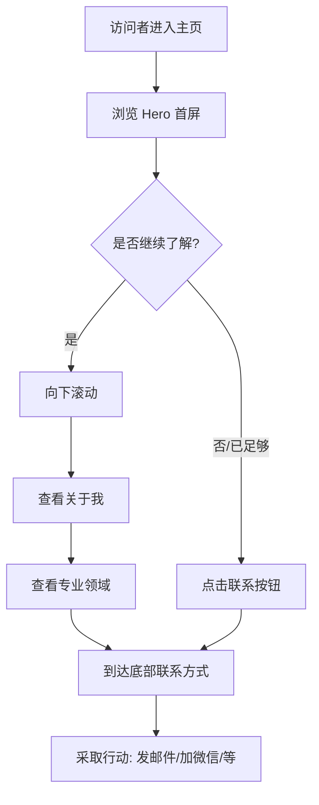

# 个人主页 PRD

| 文档信息 | |
|---------|--|
| **文档版本** | v0.1 |
| **创建日期** | 2025-01-21 |
| **作者** | 李进宝 |
| **产品类型** | 静态展示页面 |
| **目标用户** | 潜在学员、合作方、同行交流者 |

---

## 0. 版本规划

| 版本 | 定位 | 包含模块 | 状态 |
|------|------|----------|------|
| **v0.1** | MVP 最小版本 | Hero + 关于 + 能力 + 联系 + 页脚 | 📍 当前版本 |
| v0.2 | 增加服务展示 | + 课程/服务介绍 | 规划中 |
| v0.3 | 增强信任 | + 学员评价 | 规划中 |
| v0.4 | 内容运营 | + 文章/博客入口 | 规划中 |
| v0.5 | 完整版 | 全部模块 + 交互优化 | 规划中 |

---

## 1. 产品概述

### 1.1 产品定位

个人主页是李进宝的个人展示型静态页面，面向潜在的 AI 培训学员、合作方和同行交流者。v0.1 版本聚焦于**最小可行产品（MVP）**，快速上线验证基本展示效果。

### 1.2 核心目标

- 快速展示个人背景和专业定位
- 展示在 AI 赋能个体领域的专业能力
- 建立与潜在学员的联系渠道

### 1.3 v0.1 版本范围

**包含模块：**
- Hero 区域（首屏）
- 关于我
- 专业领域/技能栈
- 联系方式
- 页脚

**延后模块：**
- 课程/服务介绍 → v0.2
- 学员评价 → v0.3
- 文章/博客入口 → v0.4

### 1.4 技术约束

- **页面类型**：静态页面
- **页面形式**：单页滚动式
- **技术栈**：纯 HTML/CSS
- **部署方式**：待定（GitHub Pages / Vercel）

---

## 2. 用户旅程地图（v0.1）

```
访问者 → 浏览 Hero 首屏 → 向下滚动 → 查看关于我 → 查看专业领域
  → 到达联系方式 → 采取行动
```

---

## 3. 核心用户操作流程（v0.1）



---

## 4. 用户故事（v0.1）

v0.1 版本包含 5 个用户故事：

| 编号 | 故事 | 优先级 |
|------|------|--------|
| US-01 | Hero 区域（首屏） | P0 |
| US-02 | 关于我 | P0 |
| US-03 | 专业领域/技能栈 | P0 |
| US-04 | 联系方式 | P0 |
| US-05 | 页脚 | P0 |

---

### US-01: Hero 区域（首屏）

**作为** 访问者
**我想要** 快速了解这个页面是谁的、是关于什么的
**这样** 我可以判断是否继续浏览

#### 业务规则与逻辑

| 要素 | 设计方案 |
|------|----------|
| 姓名 | 李进宝 |
| 一句话定位 | 打造超级单人创业者 |
| 头像 | 圆形头像占位符（可后续替换） |
| 主按钮 | "了解我的能力" → 锚点跳转到专业领域区域 |
| 次要按钮 | "联系我" → 锚点跳转到底部联系方式 |
| 背景 | 深色科技风渐变 |
| 导航栏 | 固定顶部，包含：关于、能力、联系 |

#### 页面布局

```
┌──────────────────────────────────────────────────────────────────────┐
│                         [导航栏 - 固定顶部]                            │
│  李进宝                               关于  能力  联系                  │
└──────────────────────────────────────────────────────────────────────┘

┌──────────────────────────────────────────────────────────────────────┐
│                                                                      │
│    ┌──────┐                                                         │
│    │      │   李进宝                                                │
│    │ 头像 │   打造超级单人创业者                                     │
│    │占位符 │                                                         │
│    └──────┘                                                         │
│                                                                      │
│    ┌────────────────────┐    ┌────────────────────────────────┐    │
│    │   了解我的能力      │    │          联系我                │    │
│    │   [主按钮 - 强调]   │    │   [次要按钮 - 边框风格]         │    │
│    └────────────────────┘    └────────────────────────────────┘    │
│                                                                      │
│                          ▼ 向下滚动查看更多                           │
│                                                                      │
└──────────────────────────────────────────────────────────────────────┘
```

#### 验收标准

- [ ] 姓名"李进宝"正确显示
- [ ] 一句话定位"打造超级单人创业者"正确显示
- [ ] 头像区域显示占位符
- [ ] 主按钮"了解我的能力"点击后跳转到专业领域区域
- [ ] 次要按钮"联系我"点击后跳转到联系方式区域
- [ ] 导航栏固定在顶部，包含：关于、能力、联系
- [ ] 深色渐变背景正常显示
- [ ] 向下滚动提示箭头正常显示

---

### US-02: 关于我

**作为** 访问者
**我想要** 了解更多关于李进宝的背景和他在做什么
**这样** 我可以判断他的专业能力和教学理念是否适合我

#### 业务规则与逻辑

| 要素 | 设计方案 |
|------|----------|
| 内容长度 | 中等版（2段话） |
| 布局 | 左右分栏：左侧文字，右侧装饰图标 |
| 风格 | 与 Hero 区域保持一致的深色系 |

**文案内容**：

> 第一段：专注 AI 赋能个体，帮助开发者、创业者掌握 AI 工程化能力，实现"一个人活成一支队伍"。
>
> 第二段：相信 AI 不是替代者，而是放大器。通过系统化培训，让每个学员都能构建自己的 AI 工具链与工作流。

#### 页面布局

```
┌──────────────────────────────────────────────────────────────────────┐
│                                                                      │
│                           关于我                                      │
│                        ───────────                                     │
│                                                                      │
│    ┌─────────────────────────────┐    ┌─────────────────────────┐   │
│    │                             │    │                         │   │
│    │  专注 AI 赋能个体，帮助      │    │      [装饰图标/插图]      │   │
│    │  开发者、创业者掌握 AI 工     │    │                         │   │
│    │  程化能力，实现"一个人        │    │      大脑 + 放大镜        │   │
│    │  活成一支队伍"。             │    │      (AI 放大器概念)      │   │
│    │                             │    │                         │   │
│    │  相信 AI 不是替代者，而是    │    │                         │   │
│    │  放大器。通过系统化培训，    │    │                         │   │
│    │  让每个学员都能构建自己的    │    │                         │   │
│    │  AI 工具链与工作流。         │    │                         │   │
│    │                             │    │                         │   │
│    └─────────────────────────────┘    └─────────────────────────┘   │
│                                                                      │
└──────────────────────────────────────────────────────────────────────┘
```

#### 验收标准

- [ ] 区域标题"关于我"正常显示
- [ ] 两段文案正确显示
- [ ] 左右分栏布局正常
- [ ] 右侧装饰图标/插图正常显示
- [ ] 移动端自动切换为上下堆叠布局

---

### US-03: 专业领域/技能栈

**作为** 访问者
**我想要** 了解李进宝擅长哪些专业领域
**这样** 我可以判断他的能力是否匹配我的需求

#### 业务规则与逻辑

| 要素 | 设计方案 |
|------|----------|
| 专业领域 | AI 工具链、AI Agent、RAG/知识库构建 |
| 展示形式 | 卡片分类式（每个领域一张卡片） |
| 熟练度 | 不展示级别，只列出领域名称 + 简短说明 |

| 领域 | 说明文案 |
|------|----------|
| AI 工具链 | 帮助学员搭建端到端 AI 工具流 |
| AI Agent | 智能体开发与多 Agent 协作 |
| RAG/知识库构建 | 企业知识库构建方案 |

#### 页面布局

```
┌──────────────────────────────────────────────────────────────────────┐
│                                                                      │
│                        专业领域                                       │
│                     ────────────                                      │
│                                                                      │
│    ┌─────────────────────┐  ┌─────────────────────┐  ┌─────────────┐│
│    │                     │  │                     │  │             ││
│    │   [AI 图标]         │  │   [机器人图标]      │  │  [书本图标]  ││
│    │                     │  │                     │  │             ││
│    │   AI 工具链         │  │   AI Agent         │  │  RAG/知识库  ││
│    │                     │  │                     │  │             ││
│    │   帮助学员搭建       │  │   智能体开发与       │  │  企业知识    ││
│    │   端到端 AI 工具流   │  │   多 Agent 协作     │  │  库构建方案  ││
│    │                     │  │                     │  │             ││
│    └─────────────────────┘  └─────────────────────┘  └─────────────┘│
│                                                                      │
└──────────────────────────────────────────────────────────────────────┘
```

#### 验收标准

- [ ] 区域标题"专业领域"正常显示
- [ ] 三张卡片横向排列
- [ ] 每张卡片包含：图标、标题、说明文案
- [ ] 移动端自动堆叠为垂直排列
- [ ] 卡片内容与需求一致

---

### US-04: 联系方式

**作为** 访问者
**我想要** 能够方便地联系到李进宝
**这样** 我可以咨询问题或探讨合作

#### 业务规则与逻辑

| 要素 | 设计方案 |
|------|----------|
| 联系方式 | 邮箱、微信、GitHub |
| 展示形式 | 图标 + 链接卡片，居中排列 |
| 主要方式 | 邮箱（突出显示） |

> 注：以下账号为占位，实现时需替换为真实联系方式

| 方式 | 账号 |
|------|------|
| 邮箱 | your@email.com |
| 微信 | @yourwechat |
| GitHub | @yourgithub |

#### 页面布局

```
┌──────────────────────────────────────────────────────────────────────┐
│                                                                      │
│                        联系我                                         │
│                     ────────────                                      │
│                                                                      │
│              有任何问题或合作意向，欢迎随时联系                       │
│                                                                      │
│    ┌─────────────────────────────────────────────────────────────┐  │
│   │                                                              │  │
│    │                    ┌─────────────────┐                      │  │
│    │                    │                 │                      │  │
│    │                    │   [邮件图标]     │                      │  │
│    │                    │                 │                      │  │
│    │                    └─────────────────┘                      │  │
│    │                                                              │  │
│    │                       send me an email                       │  │
│    │                                                              │  │
│    │                      your@email.com                          │  │
│    │                                                              │  │
│    └─────────────────────────────────────────────────────────────┘  │
│                                                                      │
│    ┌───────────────────┐    ┌─────────────────────────────────┐    │
│    │                   │    │                                 │    │
│    │    [微信图标]      │    │      [GitHub 图标]              │    │
│    │                   │    │                                 │    │
│    │    微信           │    │      GitHub                     │    │
│    │                   │    │                                 │    │
│    │    @yourwechat    │    │      @yourgithub                │    │
│    │                   │    │                                 │    │
│    └───────────────────┘    └─────────────────────────────────┘    │
│                                                                      │
└──────────────────────────────────────────────────────────────────────┘
```

#### 验收标准

- [ ] 区域标题"联系我"正常显示
- [ ] 引导文案"有任何问题或合作意向，欢迎随时联系"正常显示
- [ ] 邮箱大卡片正常显示（图标、文字、邮箱地址）
- [ ] 微信、GitHub 小卡片正常显示
- [ ] 移动端自动堆叠为垂直排列
- [ ] 内容与需求一致

---

### US-05: 页脚

**作为** 访问者
**我想要** 看到页面底部的版权和基本信息
**这样** 我可以了解页面的归属和获取更多社交链接

#### 业务规则与逻辑

| 要素 | 设计方案 |
|------|----------|
| 内容 | Copyright 信息 + 社交链接简版 |
| 风格 | 深色背景，与整体风格保持一致 |

**内容**：
- Copyright：© 2025 李进宝 / All Rights Reserved
- 社交链接：邮箱、微信、GitHub、知乎

#### 页面布局

```
┌──────────────────────────────────────────────────────────────────────┐
│                                                                      │
│                         页脚                                         │
│                                                                      │
│                        © 2025 李进宝                                  │
│                        All Rights Reserved                           │
│                                                                      │
│        [邮箱]    [微信]    [GitHub]    [知乎]                        │
│                                                                      │
└──────────────────────────────────────────────────────────────────────┘
```

#### 验收标准

- [ ] Copyright 行正常显示："© 2025 李进宝" / "All Rights Reserved"
- [ ] 社交媒体图标链接正常显示
- [ ] 深色背景与整体风格一致
- [ ] 移动端自动适配

---

## 5. 非功能需求

### 5.1 响应式设计

- 支持桌面端（≥1024px）
- 支持平板端（768px - 1023px）
- 支持移动端（<768px）

### 5.2 性能

- 页面加载时间 < 2秒（首屏）
- 无阻塞 JavaScript（如使用）

### 5.3 兼容性

- 支持主流现代浏览器（Chrome、Firefox、Safari、Edge 最新版本）

---

## 6. 未来版本规划

### v0.2: 增加服务展示

| 模块 | 说明 |
|------|------|
| 课程/服务介绍 | 展示超级创业者、Dify智能体搭建、AI项目管理等课程 |

### v0.3: 增强信任

| 模块 | 说明 |
|------|------|
| 学员评价 | 展示真实学员评价和案例 |

### v0.4: 内容运营

| 模块 | 说明 |
|------|------|
| 文章/博客入口 | 展示精选文章，引导内容消费 |

### v0.5: 完整版

| 模块 | 说明 |
|------|------|
| 全部模块 | 所有功能模块 + 交互优化 |

---

## 7. 非功能需求

### 7.1 响应式设计

- 支持桌面端（≥1024px）
- 支持平板端（768px - 1023px）
- 支持移动端（<768px）

### 7.2 性能

- 页面加载时间 < 2秒（首屏）
- 无阻塞 JavaScript（如使用）

### 7.3 兼容性

- 支持主流现代浏览器（Chrome、Firefox、Safari、Edge 最新版本）

---

## 8. 待确认事项

| 序号 | 待确认内容 | 影响 |
|------|-----------|------|
| 1 | 真实的头像图片 | Hero 区域展示 |
| 2 | 真实的联系方式（邮箱、微信、GitHub 等） | 联系方式区域 |
| 3 | 部署方式（GitHub Pages / Vercel / 其他） | 技术实现 |

---

## 9. 附录

### 9.1 页面模块顺序汇总（v0.1）

```
1. Hero 区域（首屏）
2. 关于我
3. 专业领域/技能栈
4. 联系方式
5. 页脚
```

### 9.2 导航锚点映射（v0.1）

| 导航菜单 | 锚点目标 |
|----------|----------|
| 关于 | 关于我区域 |
| 能力 | 专业领域区域 |
| 联系 | 联系方式区域 |

---

**文档结束**
