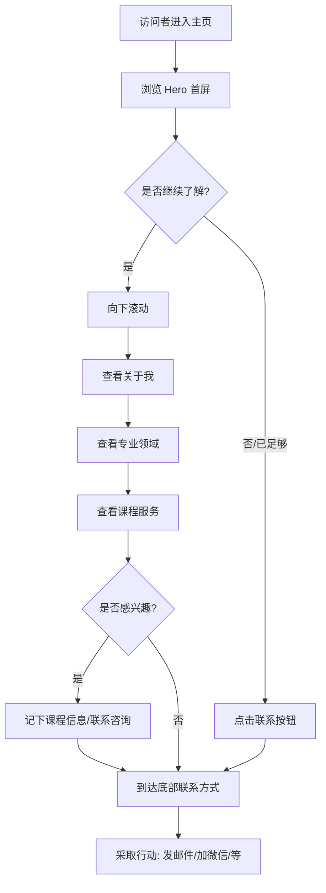

# 个人主页 PRD

| 文档信息 | |
|---------|--|
| **文档版本** | v0.2 |
| **创建日期** | 2025-01-21 |
| **作者** | 李进宝 |
| **产品类型** | 静态展示页面 |
| **目标用户** | 潜在学员、合作方、同行交流者 |

---

## 0. 版本规划

| 版本 | 定位 | 包含模块 | 状态 |
|------|------|----------|------|
| v0.1 | MVP 最小版本 | Hero + 关于 + 能力 + 联系 + 页脚 | 已完成 |
| **v0.2** | 增加服务展示 | Hero + 关于 + 能力 + **课程** + 联系 + 页脚 | 📍 当前版本 |
| v0.3 | 增强信任 | + 学员评价 | 规划中 |
| v0.4 | 内容运营 | + 文章/博客入口 | 规划中 |
| v0.5 | 完整版 | 全部模块 + 交互优化 | 规划中 |

---

## 1. 产品概述

### 1.1 产品定位

个人主页是李进宝的个人展示型静态页面，面向潜在的 AI 培训学员、合作方和同行交流者。v0.2 版本在 MVP 基础上增加**课程/服务介绍**模块，让访问者了解提供的培训服务。

### 1.2 核心目标

- 快速展示个人背景和专业定位
- 展示在 AI 赋能个体领域的专业能力
- **展示提供的课程服务**
- 建立与潜在学员的联系渠道

### 1.3 v0.2 版本范围

**包含模块：**
- Hero 区域（首屏）
- 关于我
- 专业领域/技能栈
- **课程/服务介绍**（新增）
- 联系方式
- 页脚

**延后模块：**
- 学员评价 → v0.3
- 文章/博客入口 → v0.4

### 1.4 技术约束

- **页面类型**：静态页面
- **页面形式**：单页滚动式
- **技术栈**：纯 HTML/CSS/JS
- **部署方式**：待定（GitHub Pages / Vercel）

---

## 2. 用户旅程地图（v0.2）

```
访问者 → 浏览 Hero 首屏 → 向下滚动 → 查看关于我 → 查看专业领域
  → 查看课程服务 → 到达联系方式 → 采取行动
```

---

## 3. 核心用户操作流程（v0.2）



---

## 4. 用户故事（v0.2）

v0.2 版本包含 6 个用户故事：

| 编号 | 故事 | 优先级 | 状态 |
|------|------|--------|------|
| US-01 | Hero 区域（首屏） | P0 | 已实现 |
| US-02 | 关于我 | P0 | 已实现 |
| US-03 | 专业领域/技能栈 | P0 | 已实现 |
| **US-04** | **课程/服务介绍** | **P0** | **新增** |
| US-05 | 联系方式 | P0 | 已实现 |
| US-06 | 页脚 | P0 | 已实现 |

---

### US-04: 课程/服务介绍

**作为** 访问者
**我想要** 了解李进宝提供哪些课程服务
**这样** 我可以选择适合我的课程

#### 业务规则与逻辑

| 要素 | 设计方案 |
|------|----------|
| 课程列表 | 超级创业者、Dify智能体搭建、AI项目管理 |
| 展示形式 | 卡片式（每个课程一张卡片） |
| 包含信息 | 课程编号 + 课程名 + 简介 + 大纲 + 价格 + CTA按钮 |

> 注：以下内容为占位，实现时需替换为真实课程详情

| 课程 | 简介 | 大纲 | 价格 |
|------|------|------|------|
| 超级创业者 | 帮助个体利用 AI 工具实现单人创业的完整方法论 | AI 工具链搭建 \| 自动化工作流 \| 个人品牌构建 | ¥ 2,980 |
| Dify 智能体搭建 | 从零开始掌握 Dify 平台，构建可落地的 AI 智能体 | 平台入门 \| 知识库配置 \| 工作流设计 \| 部署发布 | ¥ 1,580 |
| AI 项目管理 | AI 项目的全流程管理，从需求到上线的实战指南 | 需求分析 \| 技术选型 \| 成本控制 \| 质量保障 | ¥ 1,980 |

#### 页面布局

```
┌──────────────────────────────────────────────────────────────────────┐
│                                                                      │
│                        课程服务                                       │
│                     ────────────                                      │
│                                                                      │
│    ┌─────────────────────────────────────┐  ┌──────────────────────┐│
│    │                                     │  │                      ││
│    │  01                                 │  │  02                  ││
│    │  ─────────────────                  │  │  ────────────        ││
│    │                                     │  │                      ││
│    │  超级创业者                         │  │  Dify 智能体搭建      ││
│    │                                     │  │                      ││
│    │  帮助个体利用 AI 工具实现单人       │  │  从零开始掌握 Dify    ││
│    │  创业的完整方法论                   │  │  平台，构建可落地的    ││
│    │                                     │  │  AI 智能体           ││
│    │  大纲：                             │  │                      ││
│    │  · AI 工具链搭建                    │  │  大纲：               ││
│    │  · 自动化工作流                      │  │  · 平台入门           ││
│    │  · 个人品牌构建                      │  │  · 知识库配置         ││
│    │                                     │  │  · 工作流设计         ││
│    │  ¥ 2,980                           │  │  · 部署发布           ││
│    │                                     │  │                      ││
│    │  [了解详情]                         │  │  ¥ 1,580             ││
│    │                                     │  │  [了解详情]          ││
│    └─────────────────────────────────────┘  └──────────────────────┘│
│                                                                      │
│    ┌─────────────────────────────────────┐                          │
│    │                                     │                          │
│    │  03                                 │                          │
│    │  ─────────────────                  │                          │
│    │                                     │                          │
│    │  AI 项目管理                        │                          │
│    │                                     │                          │
│    │  AI 项目的全流程管理，从需求到      │                          │
│    │  上线的实战指南                     │                          │
│    │                                     │                          │
│    │  大纲：                             │                          │
│    │  · 需求分析                         │                          │
│    │  · 技术选型                         │                          │
│    │  · 成本控制                         │                          │
│    │  · 质量保障                         │                          │
│    │                                     │                          │
│    │  ¥ 1,980                           │                          │
│    │                                     │                          │
│    │  [了解详情]                         │                          │
│    │                                     │                          │
│    └─────────────────────────────────────┘                          │
│                                                                      │
└──────────────────────────────────────────────────────────────────────┘
```

#### 验收标准

- [ ] 区域标题"课程服务"正常显示
- [ ] 三个课程卡片正常显示
- [ ] 每个课程包含：序号、课程名、介绍、大纲、价格、CTA按钮
- [ ] 桌面端 2+1 布局（前两个一行，第三个独占一行）
- [ ] 移动端自动堆叠为垂直单列
- [ ] 卡片悬停有交互反馈

---

## 5. v0.2 变更说明

### 5.1 新增内容

| 模块 | 变更类型 | 说明 |
|------|----------|------|
| 课程/服务介绍 | 新增 | 新增模块，位于"专业领域"和"联系方式"之间 |

### 5.2 导航栏更新

| 导航菜单 | 锚点目标 | 变更 |
|----------|----------|------|
| 关于 | 关于我区域 | 无变化 |
| 能力 | 专业领域区域 | 无变化 |
| **课程** | **课程服务区域** | **新增** |
| 联系 | 联系方式区域 | 无变化 |

---

## 6. 非功能需求

### 6.1 响应式设计

- 支持桌面端（≥1024px）
- 支持平板端（768px - 1023px）
- 支持移动端（<768px）

### 6.2 性能

- 页面加载时间 < 2秒（首屏）
- 无阻塞 JavaScript

### 6.3 兼容性

- 支持主流现代浏览器（Chrome、Firefox、Safari、Edge 最新版本）

---

## 7. 未来版本规划

### v0.3: 增强信任

| 模块 | 说明 |
|------|------|
| 学员评价 | 展示真实学员评价和案例 |

### v0.4: 内容运营

| 模块 | 说明 |
|------|------|
| 文章/博客入口 | 展示精选文章，引导内容消费 |

### v0.5: 完整版

| 模块 | 说明 |
|------|------|
| 全部模块 | 所有功能模块 + 交互优化 |

---

## 8. 待确认事项

| 序号 | 待确认内容 | 影响 |
|------|-----------|------|
| 1 | 真实的头像图片 | Hero 区域展示 |
| 2 | 真实的课程详情（简介、大纲、价格） | 课程/服务介绍区域 |
| 3 | 真实的联系方式（邮箱、微信、GitHub 等） | 联系方式区域 |
| 4 | 部署方式（GitHub Pages / Vercel / 其他） | 技术实现 |

---

## 9. 附录

### 9.1 页面模块顺序汇总（v0.2）

```
1. Hero 区域（首屏）
2. 关于我
3. 专业领域/技能栈
4. 课程/服务介绍（新增）
5. 联系方式
6. 页脚
```

### 9.2 导航锚点映射（v0.2）

| 导航菜单 | 锚点目标 |
|----------|----------|
| 关于 | 关于我区域 |
| 能力 | 专业领域区域 |
| 课程 | 课程服务区域（新增） |
| 联系 | 联系方式区域 |

---

**文档结束**
