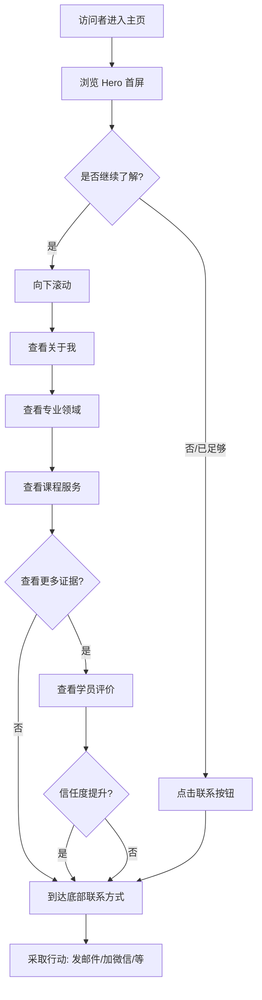

# 个人主页 PRD

| 文档信息 | |
|---------|--|
| **文档版本** | v0.3 |
| **创建日期** | 2025-01-21 |
| **作者** | 李进宝 |
| **产品类型** | 静态展示页面 |
| **目标用户** | 潜在学员、合作方、同行交流者 |

---

## 0. 版本规划

| 版本 | 定位 | 包含模块 | 状态 |
|------|------|----------|------|
| v0.1 | MVP 最小版本 | Hero + 关于 + 能力 + 联系 + 页脚 | 已完成 |
| v0.2 | 增加服务展示 | Hero + 关于 + 能力 + 课程 + 联系 + 页脚 | 已完成 |
| **v0.3** | 增强信任 | Hero + 关于 + 能力 + 课程 + **学员评价** + 联系 + 页脚 | 📍 当前版本 |
| v0.4 | 内容运营 | + 文章/博客入口 | 规划中 |
| v0.5 | 完整版 | 全部模块 + 交互优化 | 规划中 |

---

## 1. 产品概述

### 1.1 产品定位

个人主页是李进宝的个人展示型静态页面，面向潜在的 AI 培训学员、合作方和同行交流者。v0.3 版本在 v0.2 基础上增加**学员评价**模块，通过真实学员反馈增强信任感。

### 1.2 核心目标

- 快速展示个人背景和专业定位
- 展示在 AI 赋能个体领域的专业能力
- 展示提供的课程服务
- **通过学员评价建立社会认同**
- 建立与潜在学员的联系渠道

### 1.3 v0.3 版本范围

**包含模块：**
- Hero 区域（首屏）
- 关于我
- 专业领域/技能栈
- 课程/服务介绍
- **学员评价**（新增）
- 联系方式
- 页脚

**延后模块：**
- 文章/博客入口 → v0.4

### 1.4 技术约束

- **页面类型**：静态页面
- **页面形式**：单页滚动式
- **技术栈**：纯 HTML/CSS/JS
- **部署方式**：待定（GitHub Pages / Vercel）

---

## 2. 用户旅程地图（v0.3）

```
访问者 → 浏览 Hero → 向下滚动 → 查看关于我 → 查看专业领域
  → 查看课程服务 → 查看学员评价 → 到达联系方式 → 采取行动
```

---

## 3. 核心用户操作流程（v0.3）



---

## 4. 用户故事（v0.3）

v0.3 版本包含 7 个用户故事：

| 编号 | 故事 | 优先级 | 状态 |
|------|------|--------|------|
| US-01 | Hero 区域（首屏） | P0 | 已实现 |
| US-02 | 关于我 | P0 | 已实现 |
| US-03 | 专业领域/技能栈 | P0 | 已实现 |
| US-04 | 课程/服务介绍 | P0 | 已实现 |
| **US-05** | **学员评价** | **P0** | **新增** |
| US-06 | 联系方式 | P0 | 已实现 |
| US-07 | 页脚 | P0 | 已实现 |

---

### US-05: 学员评价/案例展示

**作为** 访问者
**我想要** 看到其他学员的评价
**这样** 我可以增强对课程质量的信任

#### 业务规则与逻辑

| 要素 | 设计方案 |
|------|----------|
| 内容类型 | 学员文字评价 |
| 展示形式 | 3张卡片横向排列 |
| 包含信息 | 评价内容 + 分隔线 + 评价人信息 |

> 注：以下内容为占位，实现时需替换为真实学员评价

| 评价内容 | 评价人 |
|----------|--------|
| "李老师的课程非常实用，我现在已经能独立搭建 AI 工具链了。" | 王同学 - 独立开发者 |
| "超级创业者课程让我重新思考了自己的工作流，效率提升很明显。" | 产品经理-张工 |
| "从零开始学 Dify，一周就搭出了自己的智能助手，太实用了！" | 开发者-小陈 |

#### 页面布局

```
┌──────────────────────────────────────────────────────────────────────┐
│                                                                      │
│                        学员评价                                       │
│                     ────────────                                      │
│                                                                      │
│    ┌───────────────────┐  ┌───────────────────┐  ┌─────────────────┐ │
│    │                   │  │                   │  │                 │ │
│    │  "李老师的课程    │  │  "超级创业者课    │  │  "从零开始学     │ │
│    │   非常实用，       │  │   程让我重新      │  │   Dify，一周     │ │
│    │   我现在已经能     │  │   思考了自己的    │  │   就搭出了自己   │ │
│    │   独立搭建 AI      │  │   工作流，效率    │  │   的智能助手，    │ │
│    │   工具链了。"      │  │   提升很明显。"   │  │   太实用了！"    │ │
│    │                   │  │                   │  │                 │ │
│    │  ────────────     │  │  ────────────     │  │  ───────────    │ │
│    │                   │  │                   │  │                 │ │
│    │  王同学            │  │  产品经理-张工     │  │  开发者-小陈    │ │
│    │  独立开发者        │  │                   │  │                 │ │
│    │                   │  │                   │  │                 │ │
│    └───────────────────┘  └───────────────────┘  └─────────────────┘ │
│                                                                      │
└──────────────────────────────────────────────────────────────────────┘
```

#### 验收标准

- [ ] 区域标题"学员评价"正常显示
- [ ] 三张评价卡片横向排列
- [ ] 每张卡片包含：评价内容（引号内）+ 分隔线 + 评价人信息
- [ ] 移动端自动堆叠为垂直排列
- [ ] 卡片悬停有交互反馈

---

## 5. v0.3 变更说明

### 5.1 新增内容

| 模块 | 变更类型 | 说明 |
|------|----------|------|
| 学员评价 | 新增 | 新增模块，位于"课程服务"和"联系方式"之间 |

### 5.2 导航栏更新

| 导航菜单 | 锚点目标 | 变更 |
|----------|----------|------|
| 关于 | 关于我区域 | 无变化 |
| 能力 | 专业领域区域 | 无变化 |
| 课程 | 课程服务区域 | 无变化 |
| 评价 | 学员评价区域 | 新增 |
| 联系 | 联系方式区域 | 无变化 |

---

## 6. 非功能需求

### 6.1 响应式设计

- 支持桌面端（≥1024px）
- 支持平板端（768px - 1023px）
- 支持移动端（<768px）

### 6.2 性能

- 页面加载时间 < 2秒（首屏）
- 无阻塞 JavaScript

### 6.3 兼容性

- 支持主流现代浏览器（Chrome、Firefox、Safari、Edge 最新版本）

---

## 7. 未来版本规划

### v0.4: 内容运营

| 模块 | 说明 |
|------|------|
| 文章/博客入口 | 展示精选文章，引导内容消费 |

### v0.5: 完整版

| 模块 | 说明 |
|------|------|
| 全部模块 | 所有功能模块 + 交互优化 |

---

## 8. 待确认事项

| 序号 | 待确认内容 | 影响 |
|------|-----------|------|
| 1 | 真实的头像图片 | Hero 区域展示 |
| 2 | 真实的课程详情（简介、大纲、价格） | 课程/服务介绍区域 |
| 3 | 真实的学员评价 | 学员评价区域 |
| 4 | 真实的联系方式（邮箱、微信、GitHub 等） | 联系方式区域 |
| 5 | 部署方式（GitHub Pages / Vercel / 其他） | 技术实现 |

---

## 9. 附录

### 9.1 页面模块顺序汇总（v0.3）

```
1. Hero 区域（首屏）
2. 关于我
3. 专业领域/技能栈
4. 课程/服务介绍
5. 学员评价（新增）
6. 联系方式
7. 页脚
```

### 9.2 导航锚点映射（v0.3）

| 导航菜单 | 锚点目标 |
|----------|----------|
| 关于 | 关于我区域 |
| 能力 | 专业领域区域 |
| 课程 | 课程服务区域 |
| 评价 | 学员评价区域（新增） |
| 联系 | 联系方式区域 |

---

**文档结束**
