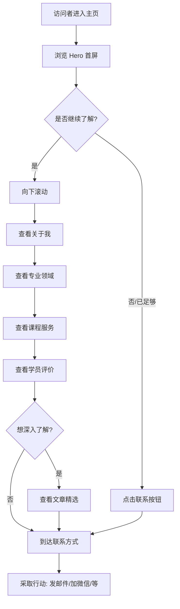

# 个人主页 PRD

| 文档信息 | |
|---------|--|
| **文档版本** | v0.4 |
| **创建日期** | 2025-01-21 |
| **作者** | 李进宝 |
| **产品类型** | 静态展示页面 |
| **目标用户** | 潜在学员、合作方、同行交流者 |

---

## 0. 版本规划

| 版本 | 定位 | 包含模块 | 状态 |
|------|------|----------|------|
| v0.1 | MVP 最小版本 | Hero + 关于 + 能力 + 联系 + 页脚 | 已完成 |
| v0.2 | 增加服务展示 | Hero + 关于 + 能力 + 课程 + 联系 + 页脚 | 已完成 |
| v0.3 | 增强信任 | Hero + 关于 + 能力 + 课程 + 学员评价 + 联系 + 页脚 | 已完成 |
| **v0.4** | 内容运营 | Hero + 关于 + 能力 + 课程 + 学员评价 + **文章精选** + 联系 + 页脚 | 📍 当前版本 |
| v0.5 | 完整版 | 全部模块 + 交互优化 | 规划中 |

---

## 1. 产品概述

### 1.1 产品定位

个人主页是李进宝的个人展示型静态页面，面向潜在的 AI 培训学员、合作方和同行交流者。v0.4 版本在 v0.3 基础上增加**文章精选**模块，展示个人写作内容，建立专业形象，引导内容消费。

### 1.2 核心目标

- 快速展示个人背景和专业定位
- 展示在 AI 赋能个体领域的专业能力
- 展示提供的课程服务
- 通过学员评价建立社会认同
- **通过文章内容展示专业深度**
- 建立与潜在学员的联系渠道

### 1.3 v0.4 版本范围

**包含模块：**
- Hero 区域（首屏）
- 关于我
- 专业领域/技能栈
- 课程/服务介绍
- 学员评价
- **文章精选**（新增）
- 联系方式
- 页脚

**延后模块：**
- 无

### 1.4 技术约束

- **页面类型**：静态页面
- **页面形式**：单页滚动式
- **技术栈**：纯 HTML/CSS/JS
- **部署方式**：待定（GitHub Pages / Vercel）

---

## 2. 用户旅程地图（v0.4）

```
访问者 → 浏览 Hero → 向下滚动 → 查看关于我 → 查看专业领域
  → 查看课程服务 → 查看学员评价 → 查看文章精选 → 到达联系方式 → 采取行动
```

---

## 3. 核心用户操作流程（v0.4）



---

## 4. 用户故事（v0.4）

v0.4 版本包含 8 个用户故事：

| 编号 | 故事 | 优先级 | 状态 |
|------|------|--------|------|
| US-01 | Hero 区域（首屏） | P0 | 已实现 |
| US-02 | 关于我 | P0 | 已实现 |
| US-03 | 专业领域/技能栈 | P0 | 已实现 |
| US-04 | 课程/服务介绍 | P0 | 已实现 |
| US-05 | 学员评价 | P0 | 已实现 |
| **US-06** | **文章精选** | **P0** | **新增** |
| US-07 | 联系方式 | P0 | 已实现 |
| US-08 | 页脚 | P0 | 已实现 |

---

### US-06: 文章精选

**作为** 访问者
**我想要** 看到作者的文章内容
**这样** 我可以更深入了解作者的专业能力和思考

#### 业务规则与逻辑

| 要素 | 设计方案 |
|------|----------|
| 位置 | 学员评价和联系方式之间 |
| 展示形式 | 3篇文章卡片横向排列 |
| 卡片内容 | 文章标题 + 摘要 + 阅读时间 + 发布日期 + 标签 |

> 注：以下内容为占位，实现时需替换为真实文章链接

| 标题 | 摘要 | 阅读时间 | 标签 |
|------|------|----------|------|
| AI 工具链搭建指南 | 从零开始构建个人 AI 工具流，涵盖选型、部署、优化的完整路径 | 8分钟 | 指南 |
| Dify 实战：搭建知识库助手 | 使用 Dify 平台快速搭建企业知识库智能助手的完整教程 | 12分钟 | 实战 |
| 单人创业者的 AI 工作流 | 如何用 AI 让一个人活成一支队伍，提升工作效率的秘密 | 6分钟 | 经验 |

#### 页面布局

```
┌──────────────────────────────────────────────────────────────────────┐
│                                                                      │
│                        文章精选                                       │
│                     ────────────                                      │
│                                                                      │
│    ┌───────────────────┐  ┌───────────────────┐  ┌─────────────────┐ │
│    │ AI 工具链搭建指南  │  │ Dify 实战：搭建    │  │ 单人创业者的     │ │
│    │ ────────────────  │  │ 知识库助手        │  │ AI 工作流       │ │
│    │                   │  │ ────────────────  │  │ ─────────────   │ │
│    │ 从零开始构建个人   │  │ 使用 Dify 平台     │  │ 如何用 AI 让     │ │
│    │ AI 工具流...       │  │ 快速搭建企业...    │  │ 一个人活成...    │ │
│    │                   │  │                   │  │                 │ │
│    │ 📖 8分钟  📅 Jan   │  │ 📖 12分钟 📅 Jan   │  │ 📖 6分钟 📅 Jan │ │
│    │    🏷️ 指南        │  │    🏷️ 实战        │  │    🏷️ 经验      │ │
│    └───────────────────┘  └───────────────────┘  └─────────────────┘ │
│                                                                      │
└──────────────────────────────────────────────────────────────────────┘
```

#### 验收标准

- [ ] 区域标题"文章精选"正常显示
- [ ] 三篇文章卡片横向排列
- [ ] 每张卡片包含：标题 + 摘要 + 阅读时间 + 发布日期 + 标签
- [ ] 移动端自动堆叠为垂直排列
- [ ] 卡片悬停有交互反馈（上浮 + 阴影增强）
- [ ] 点击卡片跳转到文章链接（占位使用 `#`）

---

## 5. v0.4 变更说明

### 5.1 新增内容

| 模块 | 变更类型 | 说明 |
|------|----------|------|
| 文章精选 | 新增 | 新增模块，位于"学员评价"和"联系方式"之间 |

### 5.2 导航栏更新

| 导航菜单 | 锚点目标 | 变更 |
|----------|----------|------|
| 关于 | 关于我区域 | 无变化 |
| 能力 | 专业领域区域 | 无变化 |
| 课程 | 课程服务区域 | 无变化 |
| 评价 | 学员评价区域 | 无变化 |
| **文章** | **文章精选区域** | **新增** |
| 联系 | 联系方式区域 | 无变化 |

---

## 6. 非功能需求

### 6.1 响应式设计

- 支持桌面端（≥1024px）
- 支持平板端（768px - 1023px）
- 支持移动端（<768px）

### 6.2 性能

- 页面加载时间 < 2秒（首屏）
- 无阻塞 JavaScript

### 6.3 兼容性

- 支持主流现代浏览器（Chrome、Firefox、Safari、Edge 最新版本）

---

## 7. 未来版本规划

### v0.5: 完整版

| 模块 | 说明 |
|------|------|
| 全部模块 | 所有功能模块 + 交互优化 |

---

## 8. 待确认事项

| 序号 | 待确认内容 | 影响 |
|------|-----------|------|
| 1 | 真实的头像图片 | Hero 区域展示 |
| 2 | 真实的课程详情（简介、大纲、价格） | 课程/服务介绍区域 |
| 3 | 真实的学员评价 | 学员评价区域 |
| 4 | 真实的文章链接和内容 | 文章精选区域 |
| 5 | 真实的联系方式（邮箱、微信、GitHub 等） | 联系方式区域 |
| 6 | 部署方式（GitHub Pages / Vercel / 其他） | 技术实现 |

---

## 9. 附录

### 9.1 页面模块顺序汇总（v0.4）

```
1. Hero 区域（首屏）
2. 关于我
3. 专业领域/技能栈
4. 课程/服务介绍
5. 学员评价
6. 文章精选（新增）
7. 联系方式
8. 页脚
```

### 9.2 导航锚点映射（v0.4）

| 导航菜单 | 锚点目标 |
|----------|----------|
| 关于 | 关于我区域 |
| 能力 | 专业领域区域 |
| 课程 | 课程服务区域 |
| 评价 | 学员评价区域 |
| 文章 | 文章精选区域（新增） |
| 联系 | 联系方式区域 |

---

**文档结束**
