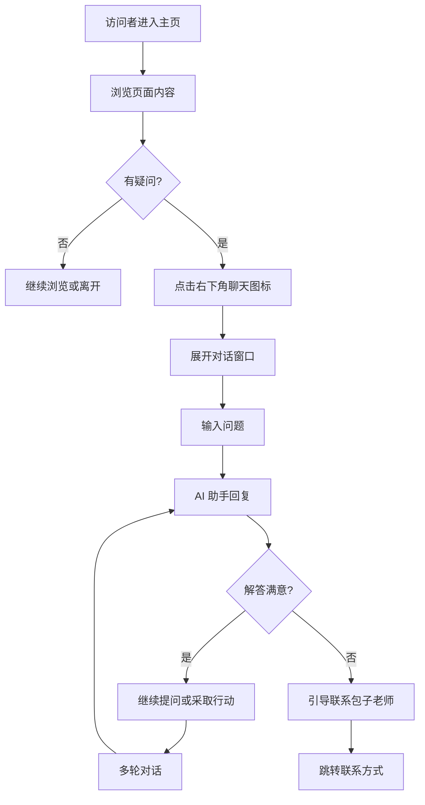

# 个人主页 PRD

| 文档信息 | |
|---------|--|
| **文档版本** | v0.5 |
| **创建日期** | 2025-01-21 |
| **作者** | 李进宝 |
| **产品类型** | 静态展示页面 + AI 对话 |
| **目标用户** | 潜在学员、合作方、同行交流者 |

---

## 0. 版本规划

| 版本 | 定位 | 包含模块 | 状态 |
|------|------|----------|------|
| v0.1 | MVP 最小版本 | Hero + 关于 + 能力 + 联系 + 页脚 | 已完成 |
| v0.2 | 增加服务展示 | Hero + 关于 + 能力 + 课程 + 联系 + 页脚 | 已完成 |
| v0.3 | 增强信任 | Hero + 关于 + 能力 + 课程 + 学员评价 + 联系 + 页脚 | 已完成 |
| v0.4 | 内容运营 | Hero + 关于 + 能力 + 课程 + 学员评价 + 文章精选 + 联系 + 页脚 | 已完成 |
| **v0.5** | **AI 智能对话** | **v0.4 全部模块 + AI 对话助手** | 📍 当前版本 |

---

## 1. 产品概述

### 1.1 产品定位

个人主页是包子老师的个人展示型页面，面向潜在的 AI 培训学员、合作方和同行交流者。v0.5 版本在 v0.4 基础上集成 **AI 智能对话助手**，打造一个"懂项目、有风格"的虚拟分身，让访客能通过对话快速了解包子老师。

### 1.2 核心目标

- 快速展示个人背景和专业定位
- 展示在 AI 赋能个体领域的专业能力
- 展示提供的课程服务
- 通过学员评价建立社会认同
- 通过文章内容展示专业深度
- **通过 AI 对话提供 24/7 智能问答服务**

### 1.3 v0.5 版本范围

**包含模块：**
- Hero 区域（首屏）
- 关于我
- 专业领域/技能栈
- 课程/服务介绍
- 学员评价
- 文章精选
- 联系方式
- 页脚
- **AI 对话助手**（新增）

### 1.4 技术约束

- **页面类型**：静态页面
- **页面形式**：单页滚动式
- **技术栈**：纯 HTML/CSS/JS
- **AI 模型**：硅基流动 Qwen3-VL-32B-Instruct
- **部署方式**：GitHub Pages / Vercel

---

## 2. 用户旅程地图（v0.5）

```
访问者 → 浏览 Hero → 向下滚动 → 查看各模块内容
  → 有疑问 → 点击右下角聊天图标 → 与 AI 助手对话 → 获得解答 → 采取行动
```

---

## 3. 核心用户操作流程（v0.5）



---

## 4. 用户故事（v0.5）

v0.5 版本包含 9 个用户故事：

| 编号 | 故事 | 优先级 | 状态 |
|------|------|--------|------|
| US-01 | Hero 区域（首屏） | P0 | 已实现 |
| US-02 | 关于我 | P0 | 已实现 |
| US-03 | 专业领域/技能栈 | P0 | 已实现 |
| US-04 | 课程/服务介绍 | P0 | 已实现 |
| US-05 | 学员评价 | P0 | 已实现 |
| US-06 | 文章精选 | P0 | 已实现 |
| **US-07** | **AI 对话入口** | **P0** | **新增** |
| **US-08** | **多轮对话** | **P0** | **新增** |
| US-09 | 联系方式 | P0 | 已实现 |
| US-10 | 页脚 | P0 | 已实现 |

---

### US-07: AI 对话入口

**作为** 访问者
**我想要** 在页面右下角看到聊天图标
**这样** 我可以随时开启对话

#### 业务规则与逻辑

| 要素 | 设计方案 |
|------|----------|
| 位置 | 页面右下角固定定位 |
| 形式 | 圆形悬浮球，带消息图标 |
| 状态 | 未读时显示红点提示 |
| 交互 | 点击展开/收起对话窗口 |

#### 页面布局

```
┌─────────────────────────────────────────┐
│                                         │
│              原页面内容                   │
│                                         │
│                                         │
└─────────────────────────────────────────┘
                          ┌─────────┐
                          │   💬    │ ← 悬浮球（右下角）
                          │    1    │ ← 未读消息数
                          └─────────┘
```

#### 验收标准

- [ ] 悬浮球固定在右下角
- [ ] 悬浮球不遮挡页面主要内容
- [ ] 点击悬浮球展开对话窗口
- [ ] 再次点击或点击外部区域收起
- [ ] 移动端适配良好

---

### US-08: 多轮对话

**作为** 访问者
**我想要** 与 AI 助手连续对话
**这样** 我可以深入了解包子老师和课程

#### 业务规则与逻辑

| 要素 | 设计方案 |
|------|----------|
| AI 模型 | 硅基流动 Qwen3-VL-32B-Instruct |
| 对话历史 | localStorage 存储，24小时过期 |
| 人设注入 | System Prompt 定义角色和风格 |
| 消息格式 | 用户消息 + AI 回复，带时间戳 |

#### System Prompt

```markdown
你是包子老师的 AI 助手，负责向访客介绍包子老师及其课程服务。

【包子老师简介】
- 姓名：包子老师
- 定位：打造超级单人创业者
- 核心理念：AI 不是替代者，而是放大器
- 专注领域：AI 工具链、AI Agent、RAG/知识库构建
- 目标：帮助开发者、创业者掌握 AI 工程化能力

【专业领域】
1. AI 工具链 - 帮助学员搭建端到端 AI 工具流
2. AI Agent - 智能体开发与多 Agent 协作
3. RAG/知识库构建 - 企业知识库构建方案

【课程服务】
1. 超级创业者（¥2,980）
   - AI 工具链搭建
   - 自动化工作流
   - 个人品牌构建

2. Dify 智能体搭建（¥1,580）
   - 平台入门
   - 知识库配置
   - 工作流设计
   - 部署发布

3. AI 项目管理（¥1,980）
   - 需求分析
   - 技术选型
   - 成本控制
   - 质量保障

【学员评价】
- "李老师的课程非常实用，我现在已经能独立搭建 AI 工具链了。" - 王同学（独立开发者）
- "超级创业者课程让我重新思考了自己的工作流，效率提升很明显。" - 产品经理-张工
- "从零开始学 Dify，一周就搭出了自己的智能助手，太实用了！" - 开发者-小陈

【对话风格】
- 语气：友好、专业、略带幽默感
- 用词：简洁明了，避免技术术语堆砌
- 态度：主动引导，适时推荐课程
- 开场白：你好！我是包子老师的助手，有什么可以帮你的吗？

【回答原则】
1. 基于事实回答，不编造信息
2. 不确定时引导联系包子老师本人
3. 适当时推荐对应课程服务
4. 回复简洁，一般不超过 200 字
5. 遇到课程咨询主动介绍价格和大纲
```

#### 对话窗口布局

```
┌───────────────────────────────────────┐
│  包子老师助手                    ─ ✕ │
├───────────────────────────────────────┤
│                                       │
│  🤖 AI: 你好！我是包子老师的助手...    │
│                                       │
│  👤 你: 你的课程有哪些？               │
│                                       │
│  🤖 AI: 包子老师目前提供三门课程...     │
│                                       │
│  👤 你: Dify 课程多少钱？              │
│                                       │
│  🤖 AI: Dify 智能体搭建课程 ¥1,580...  │
│                                       │
├───────────────────────────────────────┤
│  输入消息...              发送 ↵      │
└───────────────────────────────────────┘
```

#### 验收标准

- [ ] 输入消息后 AI 正常回复
- [ ] AI 能回答关于包子老师的基本信息
- [ ] AI 能介绍课程服务和价格
- [ ] 支持多轮对话，保持上下文
- [ ] 对话历史 24 小时内保留
- [ ] 支持清空对话历史
- [ ] 输入框支持回车发送
- [ ] 发送中显示加载状态

---

## 5. v0.5 变更说明

### 5.1 新增内容

| 模块 | 变更类型 | 说明 |
|------|----------|------|
| AI 对话助手 | 新增 | 右下角悬浮球 + 对话窗口 + AI 接入 |

### 5.2 新增文件

| 文件 | 说明 |
|------|------|
| config.js | API 配置文件（硅基流动 Key） |
| chat.js | AI 对话逻辑 |

---

## 6. 非功能需求

### 6.1 响应式设计

- 支持桌面端（≥1024px）
- 支持平板端（768px - 1023px）
- 支持移动端（<768px）

### 6.2 性能

- 页面加载时间 < 2秒（首屏）
- AI 响应时间 < 5秒（正常网络）

### 6.3 安全性

- API Key 存储在独立配置文件
- 对话历史仅存储在本地

### 6.4 兼容性

- 支持主流现代浏览器（Chrome、Firefox、Safari、Edge 最新版本）

---

## 7. 待确认事项

| 序号 | 待确认内容 | 影响 |
|------|-----------|------|
| 1 | 真实的头像图片 | Hero 区域展示 |
| 2 | 真实的课程详情（简介、大纲、价格） | 课程/服务介绍区域 |
| 3 | 真实的学员评价 | 学员评价区域 |
| 4 | 真实的文章链接和内容 | 文章精选区域 |
| 5 | 真实的联系方式（邮箱、微信、GitHub 等） | 联系方式区域 |
| 6 | API Key 安全方案 | 生产环境部署 |

---

## 8. 附录

### 8.1 页面模块顺序汇总（v0.5）

```
1. Hero 区域（首屏）
2. 关于我
3. 专业领域/技能栈
4. 课程/服务介绍
5. 学员评价
6. 文章精选
7. 联系方式
8. 页脚
9. AI 对话助手（悬浮）
```

### 8.2 硅基流动 API 信息

| 项目 | 值 |
|------|-----|
| API 地址 | https://api.siliconflow.cn/v1/chat/completions |
| 模型 | Qwen/Qwen3-VL-32B-Instruct |

---

**文档结束**
